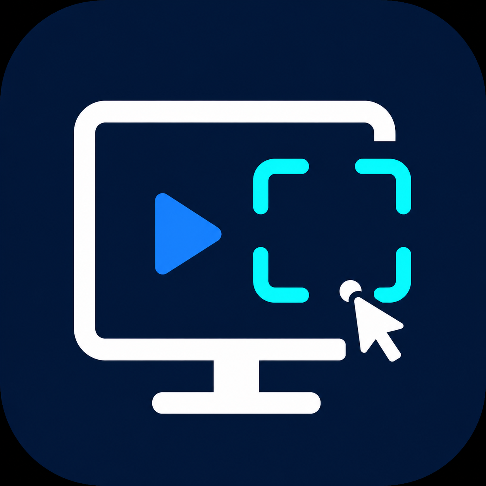

# 网课视频播放助手 · CoursePilot

<p></p>

> 视频看到一半，弹出“我还在看”又要手动点？
>
> CoursePilot 会在你选定的课程窗口中，用本地 OCR 识别白名单提示，并点击对应的继续观看按钮。选窗口、点启动，减少重复确认对学习过程的打断。

CoursePilot 是一个面向 macOS 和 Windows 的本地屏幕识别工具。它不装浏览器插件、不注入网页，也不上传屏幕内容；只处理用户明确选择的窗口和提示词。

它不依赖油猴脚本、浏览器插件或特定网站适配器，屏幕内容只在本机处理，适合重复出现观看确认弹窗的课程播放场景。

> 当前状态：macOS Apple Silicon 版本已完成本机验证；Windows 测试适配器已接入，等待实体 Windows 电脑验证。

## 功能特点

- 本地 AI/OCR 识别屏幕中的继续观看提示。
- 支持 Chrome、哔哩哔哩及其他可捕获的普通窗口。
- 只识别白名单提示词，不处理提交、交卷、支付、购买、删除等操作。
- 支持用户添加自定义按钮文字，并在设置页面显示内置提示词。
- 不上传屏幕内容，不注入网页，不修改网页代码。
- macOS 使用 Apple Vision 和 ScreenCaptureKit 本地处理。
- Windows 使用原生窗口列表、截图和鼠标输入控制；OCR 依赖本机 Tesseract。

## 搜索关键词

网课辅助、刷课辅助、课程播放自动化、自动处理继续观看、AI 屏幕识别、本地 OCR、自动点击提示、视频播放助手、macOS、Windows、CoursePilot。

## macOS 使用教程

### 1. 下载并启动（普通用户）

在 GitHub Releases 下载 `CoursePilot-macOS-arm64.zip`，解压后将 `CoursePilot.app` 拖到“应用程序”文件夹，再双击启动。

这是 Apple Silicon 版本。如果 macOS 提示无法验证开发者，请在 Finder 中右键点击 `CoursePilot.app`，选择“打开”，再确认打开。首次启动仍然需要授予屏幕录制和辅助功能权限。

### 2. 从源码运行（开发者）

```sh
git clone https://github.com/fsh114514/CoursePilot.git
cd CoursePilot
python3 -m venv .venv
.venv/bin/pip install -e '.[macos]'
./run_macos.command
```

也可以直接双击 `run_macos.command` 启动。

### 3. 第一次使用

1. 打开“系统设置 → 隐私与安全性”。
2. 在“屏幕录制”中允许 Python 或 CoursePilot。
3. 在“辅助功能”中允许 Python 或 CoursePilot。
4. 重启程序。
5. 把课程窗口放到当前台前调度组，并点击“刷新窗口”。
6. 从列表选择课程窗口，确认预览正确。
7. 点击“开始监控”。

### 4. 添加自定义提示词

只填写按钮上实际显示的文字，例如：

- 继续学习
- 继续播放课程
- 我还在学习

不要填写“提交”“交卷”“支付”“购买”“删除”等页面操作词。程序自带的提示词会在设置页面直接列出，不需要重复添加。

### macOS 注意事项

- 台前调度收起的窗口可能无法提供完整画面，请把目标窗口放回当前调度组。
- 某些受系统保护的窗口可能无法捕获。
- 程序只会点击白名单提示词附近的按钮，不会自动答题或修改学习记录。

## Windows 使用教程

Windows 版目前是测试包，已提供原生窗口列表、窗口预览、截图识别和鼠标点击功能。由于 Windows OCR 依赖本机 Tesseract，请先安装 Tesseract，并在安装时勾选中文语言包 `chi_sim`，确保 `tesseract.exe` 已加入 PATH。

1. 在 Release 下载 `CoursePilot-Windows-x64.zip` 并解压。
2. 启动 `CoursePilot.exe`。
3. 点击“刷新窗口”，选择课程视频窗口并确认预览。
4. 确认提示词后点击“开始监控”。

这是首个 Windows 测试包，尚未在本项目维护者的实体 Windows 电脑上完成验收；如果窗口列表、预览或 OCR 有问题，请附上系统版本和运行日志反馈。

## 本地测试页

运行下面的命令会启动本地测试页：

```sh
./run_test_site.command
```

页面会在几秒后显示“我还在看”，用于验证窗口预览、OCR 识别和按钮点击。测试页只在 `127.0.0.1` 本机运行。

## 当前 Release

`v0.1.1` 提供 Windows x64 测试包，`v0.1.0` 提供 macOS Apple Silicon 包：

- `CoursePilot-Windows-x64.zip`
- `CoursePilot-Windows-x64.zip.sha256`
- `CoursePilot-macOS-arm64.zip`
- `CoursePilot-macOS-arm64.zip.sha256`

## 隐私与安全

- 屏幕内容默认只在本机处理。
- 不要求登录、不上传截图、不收集课程账号信息。
- 只允许用户配置继续观看类白名单词。
- 不提供隐藏自动化行为、绕过平台风控或规避反作弊检测的功能。

## 开发状态

```text
macOS：可用原型，已完成本地测试
Windows：测试版，待实体 Windows 电脑验证
Linux：暂不计划
```

## 许可证

本项目使用 [MIT License](LICENSE)。
